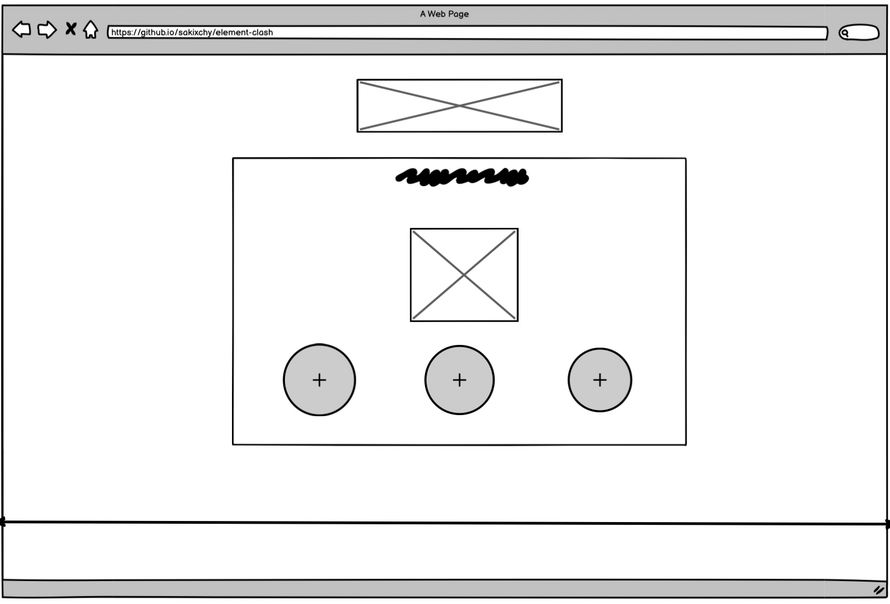
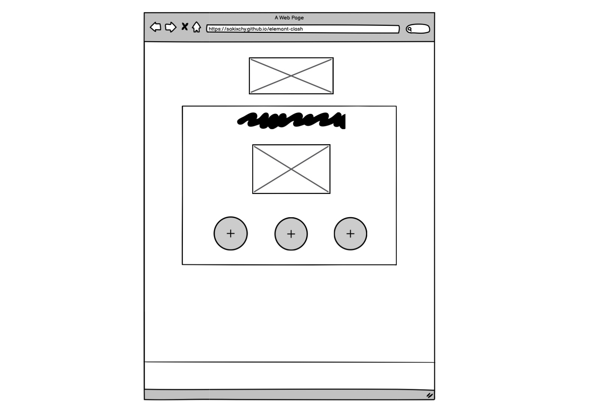
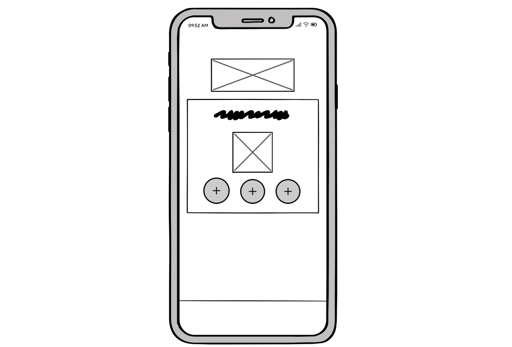

# Element Clash Game

___

This is a web-based game, similar to the traditional 'Rock, Paper, Scissors' game.  
Here are few distinctive features that sets this apart, the core role of the game are as follows :  
- Water beats Fire
- Fire beats Snow 
- Snow beats Water  
You'll be playing against the Computer, and the game will be played for a total of 10 points. 
In the event of a draw, neither player will receive a point. 
The winner will be determined by the first player to reach 10 points.

Use the elements and see if you can reach 10 points before Computer! [play here](https://sakixchy.github.io/element-clash/)

## Wireframes

  
  
  
___

## User Experience (UX) 
### User Stories
#### As a first time user
- I want to receive a clear instruction of the game.
- I want to easily navigate around the game interface.
- I want to create a user associated with the game.
- I want to receive feedback on my actions while playing the game.
- I want to receive an outcome at the end of the game.

#### As a returning user
- I want to start the game all over again.

### This game is suited to play in all shapes of devices.

___

## Structure

