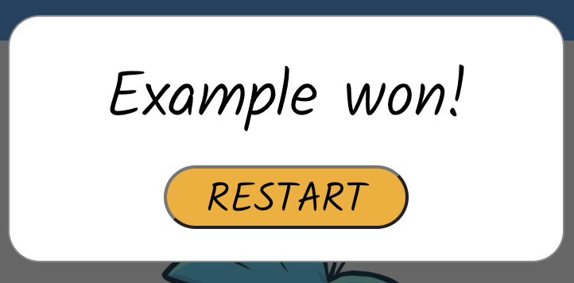

# Element Clash Game

___

# Table of Contents
- [Website Goal](#Website-Goal)
- [Website Information](#Website-Information)
- [Wireframes](#Wireframes)
- [User Experience (UX)](#User-Experience-UX)
- [Structure](#Structure)
- [Design](#Design)
- [Features](#Features)
- [Future Features Implementations](#Future-Features-Implementation)
- [Technologies](#Technologies)
- [Testing](#Testing)
- [Deployment](#Deployment)
- [Credits](#Credits)
- [Acknowledgement](#Acknowledgment)

___

## Website Goal
This web-based game was created to fill the void left by the shutdown of the original game. 
Long-time fans of this franchise can now rejoice and relive their favorite moments on this website while  
enjoying a game inspired by the original. The visual representation is designed to create a sense of connection and   familiarity for the user.

## Website Information
This is a web-based game, similar to the traditional 'Rock, Paper, Scissors' game.  
Here are few distinctive features that sets this apart, the core role of the game are as follows :  
- Water beats Fire
- Fire beats Snow 
- Snow beats Water  
You'll be playing against the Computer, and the game will be played for a total of 10 points. 
In the event of a draw, neither player will receive a point. 
The winner will be determined by the first player to reach 10 points.

Use the elements and see if you can reach **10 points** before Computer! [play here](https://sakixchy.github.io/element-clash/)

## Wireframes

  
  
  
___

## User Experience (UX) 
### User Stories
#### As a first time user
- I want to receive a clear instruction of the game.
- I want to easily navigate around the game interface.
- I want to create a user associated with the game.
- I want to receive feedback on my actions while playing the game.
- I want to receive an outcome at the end of the game.

#### As a returning user
- I want to start the game all over again.

### This game is suited to play in all shapes of devices.

___

## Structure
### Element Clash 
#### Modal 
- It contains the information about the game.
- A clear instruction to play the game.
- A username input for displaying user score and outcome of the game.
- A 'Play' button to get into game interface.

##### User Goal:
> - Resonate with the old Club Penguin franchise and the game itself.
> - Be able to play the game without the fear of malicious activity.

##### Website Goal:
> - A concise text about the game for the user to not get bored with,  
and jump into action.

#### Game (UI) Interface
- The logo of the franchise.
- A score counter for user and computer.
- An image of different facial expression after winning or losing a round.
- Three types of buttons as an image to choose from: (Fire), (Water), (Snow).

##### User Goal:
> - Be aware of the points accumulated against computer.
> - Various expressions that correspond to winning or losing,  
enhancing the enjoyment and overall visual experience.

##### Website Goal:
> - Ensure to provide with feedback, whether they win or lose   
through written messages.
> - Provide a smooth experience from all aspects of the game.
___

## Design
### Color Scheme
The website comes with a color scheme reminiscent of the original 'Club Penguin'.  
It evokes a sense of nostalgia and familiarity for prior fans while  
offering a welcoming atmosphere for new players.  
 
> RGB (15, 143, 233) 

### Typography 
The 'Kalam' font was used to serve two purpose:  
Firstly, its old-school aesthetic aligns perfectly with   
the characteristics of the original game, evoking a sense of nostalgia for old fans.  
Secondly, its playful appearance adds a touch of charm for the visual experience to the users.  
['Kalam' Font](https://fonts.google.com/share?selection.family=Kalam:wght@300)

### Images
The images used are all representative of the original game, from the logo to each element   
inside the game. This was intentionally done to give the game an explicitly familiar  
experience, allowing fans to get a clear grasp of its visual style.

___

## Features
### Modal
  
This is very beginning of the user interaction, whereby the user is greeted with the modal  
that displays useful information and some input from the user is required here.  

  
This particular modal is shown when the game has reached to an end, meaning either user or computer  
has reached total of 10 Points. it's there to show in text the result of the game as well as a restart button.  

  
This username field is there to display the score in the game associated with your name.
It has a maximum limit of seven (7) letters to ensure the scoreboard remians neat and organazed.  

### Game Components and Mechanincs
  
There are three (3) image-buttons with hover effects on Laptops/Desktops,  
and larger-scale effects on mobile devices. These buttons represent game moves that a user can make  
to achieve an outcome against the computer.   

  
The score is tracked and displayed in this designated area. It will only add a value for wins while ignore draw and loses.  

  
  
  
These messages will be displayed corresponding to state of the game, they can make the user follow  
their moves and understand the reason behind the outcome. Also, as part of expressing the current state,  
there are these creatures from the 'Club Penguin' universe called Puffles, and they show the emotional state  
of the Puffles, who can either appear happy or sad, reflecting the current game state.  

  
The 'Club Penguin' logo is iconic to many people who were into browser games in the old times.  

### Footer
  
A word from developer about the fond memoeries associated with the original game, which served  
as the driving force behind a smiliar gaming experience.  
Copyright information is also put in there.

### Responsive layout
The website and the game itself have been optimized for seamless play on all major devices  
with one exception: The Galaxy Fold in its closed form. Due to the width of the in in this state  
it may not provide the best experience for users. We recommend users to use the device in its open position  
when playing the game for optimal experience.

___

## Future Features Implementation
- Add a required username input before able to click the play button.
- Add some sort of high-score system.
___

## Technologies
- HTML for showing the content and structuring the website.
- CSS  for styling the website and giving it the gaming visuals.
- JavaScript for putting logic and interaction in the game.
- [Gitpod](https://www.gitpod.io/) IDE to work on my website.
- [GitHub](https://www.github.com/) to save code and deploy live website.
- [Google Fonts](https://fonts.google.com/) for typography.
- [Balsamiq](https://balsamiq.com/wireframes/?gad=1&gclid=CjwKCAjwo9unBhBTEiwAipC113X24sWLN9_P9LZ-X5AGhpq_VV7aagvL3dAZRIpwDHZNDMB_FVJhQBoCDM4QAvD_BwE) for creating the wireframes.
- ColorZilla Extention for picking the exact color from original game. 

___

## Testing
### User Story Testing

| User Story | Expected Outcome | Actual Outcome |
|------------|-------------|-----------------|
| As a user, when I load the website, I want to see a modal containing information about the game, a username input field, and a play button. | The modal should give an introduction to what the game is about. The modal should be clear and concise and capture user's interest. | Modal displays game information, username input field, and play button. | 
| As a user, I will be able to enter my username in the input field.  | Username input field is visible and a placeholder to guide the user | Username input field is functional and allows user to type upto 7 characters. |
| As a user, I will be able to click Play button and start playing  | When the user clicks the "Play" button, it should close the modal and display the game area or interface.| When the user clicks the "Play" button, the modal closes. |
| As a user, I want to able to click on the 'game moves', which are Fire, Water and Snow. | Clicking these buttons should display an outcome. | The game interface changes in visuals upon clicking these buttons. |
| As a user I will be able to keep track of mine and computer's points. | The scoreboard should have username with the points accumulated during the game. | The scoreboard shows the points of the user as well as the computer. |
| As a user I want to see the game outcome and a restart button after end of the game | After the game ends, there should be a clear display of the game outcome, indicating whether the user won or lost. There should be a restart button that allows the user to start over the game. | Game outcome is displayed in a modal and a restart button that refreshes the page. |

___

### Feature Testing
- I have checked the user can enter a username and not go over the capped 7 characters limit.
- I have checked the user can click on the 'Play' button and it no longer shows the modal.
- I have checked the user can click on element buttons to make their moves and it shows the corresponding results.
- I have checked the scoreboard updates by one 1 points upon each win whether by user or computer.
- I have checked the outcome modal appears when the game ends, therein ability to restart the game.
___

### Browser Testing

| Browser | Pass / Fail |
|---------|-------------|
| Chrome  |      ✓      |
| Safari  |      ✓      |
| Firefox |      ✓      |

___

### Automated Testing
###### Code Testing
- Passes the HTML Validator test [here](https://validator.w3.org/nu/?doc=https%3A%2F%2Fsakixchy.github.io%2Felement-clash%2F)  
- Passes the CSS  Validator test [here](https://jigsaw.w3.org/css-validator/validator?uri=https%3A%2F%2Fsakixchy.github.io%2Felement-clash%2F&profile=css3svg&usermedium=all&warning=1&vextwarning=&lang=en)  
- Passes the JavaScript Quality Control Tool [here](https://jshint.com/)  

###### Lighthouse Testing
1. Desktop  
  

2. Mobile  
  

___

## Deployment
This project was deployed to Github pages. 
These are the steps taken to deploy this project:  
1. Go to the website [Github](https://github.com/)
2. Click on 'Sign up' located at the top right corner of the page.
3. Enter a valid and untaken email-address and password to complete the registration process.
4. Sign-in to Github account.
5. Click on `element-clash` from the list of repositories.
6. Go to `Settings` on far-right from the header section.
7. Click on `Pages` on the left side of the menu under **Code and automation** heading.
8. Click on `Deploy from a branch` under **Source**.
9. Select `main` from the dropwdown and the folder should remain `root` next to it.
10. Click `Save` 
11. A message will pop up telling the website is ready to be deployed. 
Then refresh the page and a green outline at the top of the page will appear including 
the deployed website link.
12. Click on the link and the live website is on display. 
The link to live website is [here](https://sakixchy.github.io/element-clash/)

**To Clone the repository**
1. On the Home of the `element-clash` in Github.
2. CLick on the green `Code` button.
3. Copy the **HTTPS** link under Clone sub heading.
4. Open any code editor.
5. Type in `git clone` in the terminal and paste the url from earlier.
6. Press `Enter` to create a local version of this repository.

**Download this the repository**
1. On the Home of the `element-clash` in Github.
2. CLick on the green `Code` button.
3. Select `Download ZIP` at the bottom.
4. Save the folder and extract it to desired location.
5. Open any Code Editor.
6. Find the repository from where it was saved on the system.
7. Open it and the respository will be available to work offline.

___

## Credits
### Media
#### Images
- Favicon is taken from [here](https://static.wikia.nocookie.net/club-penguin-rewritten/images/f/f9/Card_Jitsu_Deck.png/revision/latest/scale-to-width-down/700?cb=20180603012940)
- 'Club Penguin' franchise logo used in header from [here.](https://1000logos.net/club-penguin-logo/)
- Fire, Water and Snow elements taken from [here.](https://clubpenguin.fandom.com/wiki/Starter_Deck)
- Puffle expressions were taken from : [happy puffle here](https://static.wikia.nocookie.net/newclubpenguin/images/0/0f/Blue_Puffle.png/revision/latest?cb=20200712035104) and [sad puffle here.](https://static.wikia.nocookie.net/clubpenguin/images/8/8e/BluePuffleSleepy.png/revision/latest/scale-to-width-down/250?cb=20140831122227.)

### Code
This project was inspired by a YouTube tutorial based on a similar game (Rock, Paper, Scissors).  
I successfully integrated the main components of the game mechanics into my project, 
all thanks to this tutorial [here.](https://www.youtube.com/watch?v=jaVNP3nIAv0)  

The modal feature on my page were shown by this Youtuber [here.](https://www.youtube.com/watch?v=6ophW7Ask_0)
___

## Acknowledgement
I would like to thank my mentor Ronan McClelland for guiding me and giving me the power to complete this project.  
I would also like to thank my peers over at Slack, as usual they have been very supportive and giving me motivation.
I really appreciate everyone who were nice and helpful towards me, not only does it make coding fun but also 
make you feel a sense belonging within the community.
